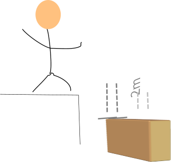
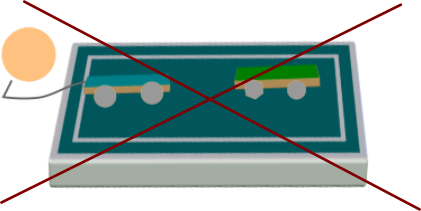

Cuadrilátero 
-----------------------
El área del batalla determinado para esta competencia es el cuadrílatero, en el cuál para poder se uso de él se deben cumplir las siguientes condiciones: 

- El cuadrilatero debe: 
  - Poseer un área de 4 metros cuadrados.
  - Estar colocado a una altura de 20 centimetros por arriba del nivel del suelo. 
  - Estar rodeado de una malla u material protector, con una altura mínima de 50 cm. 
 
  
  
- El equipo de organización puede: 
  - Colocar todo tipo de trampas que no demuestren peligro alguno para los espectadores. 
  
  
- Los espectadores y jugadores debe:
  - Estar a una distancia mínima de 50cm detrás y a 2 metros de altura de la malla del cuadrilatero. 
  
  
  
-  Ninguna persona puede: 
    - Ingresar al ring para intervenir de forma manual en la batalla mientras se esté en curso. 
    
  
